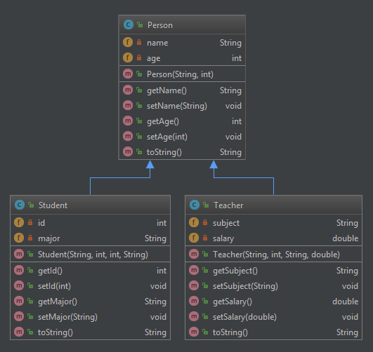

# Lab 5: Inheritance and Polymorphism

## Tasks

In this lab, there are three classes: `Person`, `Student`, and `Teacher`.
The following class diagram shows the members in them and the inheritance relationship between them.
Your task is to complete the three classes according to the diagram.

  
Note: this was actually generated automatically by Intellij. 
You can create it by right-clicking the class/project, then click on [Diagrams] -> [Show Diagrams].
The members with a green open lock are public, and those with a red lock are private. 
You may implement the `toString()` method however you like, as long as the returning string contains 
the simple name of the class.
You may verify your implementation by running the provided test cases as in previous labs.

## Submission

You should submit three files: `Person.java`, `Student.java`, and `Teacher.java` to CASS.
Remember to run the test cases to check you implementation before submission.
The deadline is October 14, 2021, 23:59:00 HKT.
