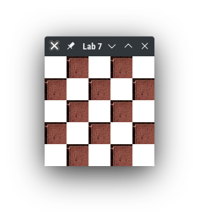
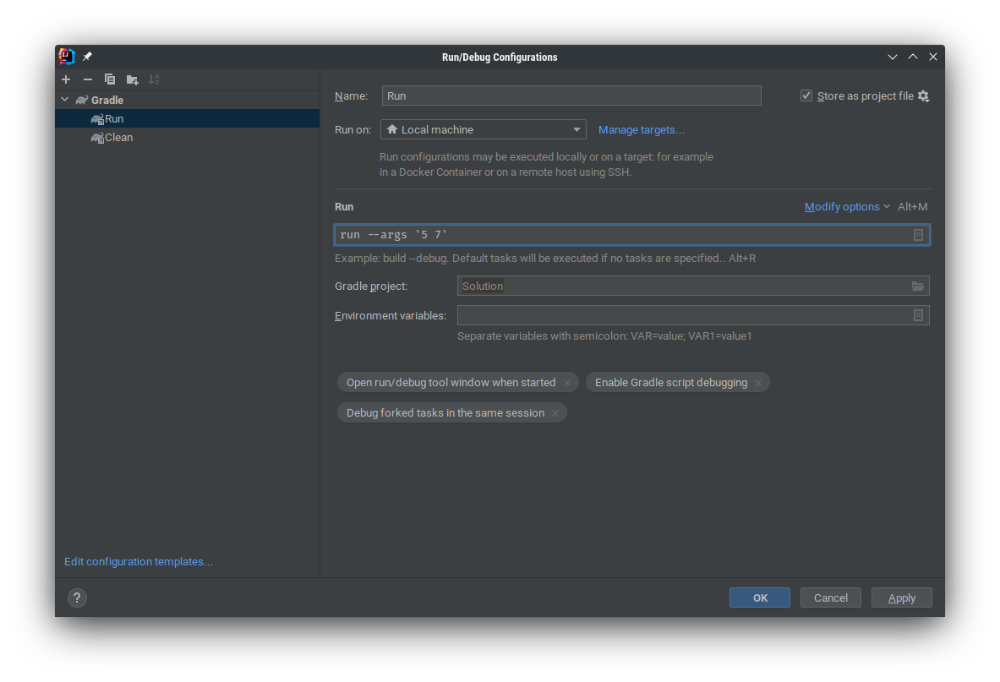

# Lab 7: GUI programming & JavaFX

This lab will introduce you to the following topics:

- JavaFX, specifically:
  - Scenes
  - GridPane
  - ImageView

## Introduction to JavaFX

JavaFX is a GUI framework for Java applications, utilizing a theater metaphor to represent the GUI. A single stage can
display different scenes, which in turn are composed of panes holding different GUI nodes.

Typically, a JavaFX application is structured as follows:

1. Define a class which extends `javafx.application.Application`.
  - This will define the class to be a JavaFX application class.
2. Override `public void start(Stage primaryStage)` of `Application` in your class.
  - This method is executed when JavaFX's internal components are initialized.
3. In the `start` method, initialize any scenes and/or the primary stage. This usually consists of:
  - Create different GUI nodes which needs to be present in a scene.
  - Create a root node which houses all child GUI nodes, and link the different GUI nodes together.
  - Create a scene, and set the root of the scene to the root node.
  - Set up the `primaryStage` by setting the scene to the scene we just created.
4. Define a main method which launches the application (`launch(args)`).
  - This allows the GUI to be launched via the command-line.

In this lab, we will use a `GridPane` as the root node, which contains multiple `ImageView` nodes. Conceptually, it 
looks like this:

```
+-Stage-------------------------------+
| +-Scene---------------------------+ |
| | +-GridPane--------------------+ | |
| | | +-ImageView-+ +-ImageView-+ | | |
| | | |           | |           | | | |
| | | |           | |           | | | |
| | | |           | |           | | | |
| | | +-----------+ +-----------+ | | |
| | | +-ImageView-+ +-ImageView-+ | | |
| | | |           | |           | | | |
| | | |           | |           | | | |
| | | |           | |           | | | |
| | | +-----------+ +-----------+ | | |
| | +-----------------------------+ | |
| +---------------------------------+ |
+-------------------------------------+
```

### GridPane and ImageView

We will use GridPane to render the GameBoard in PA2. `GridPane`s are one way to layout components in a scene.

The JavaDocs can be found [here](https://openjfx.io/javadoc/17/javafx.graphics/javafx/scene/layout/GridPane.html).

To display images in JavaFX, we use `ImageView`. 

The difference between `Image` and `ImageView` is that `Image`s are abstract representations of images, whereas 
`ImageView`s are `Node`s which are used to display images in `Scene`s.

The JavaDocs for `Image` and `ImageView` can be found 
[here](https://openjfx.io/javadoc/17/javafx.graphics/javafx/scene/image/Image.html) and 
[here](https://openjfx.io/javadoc/17/javafx.graphics/javafx/scene/image/ImageView.html) respectively.

## Submission

### Tasks

Your task for this lab is to complete the implementation of the following methods:

- `Main.start()`
- `Main.createBoardScene(int, int)`
- `Main.createGridPane(int, int)`
- `Main.createImageView(Image)`

An example for a 5x5 GameBoard should look like this:



All other methods have already been implemented for you. 

Note that you do not need to consider the case where `numRows` or `numCols` is not a positive integer. However, you 
should make sure your implementation works for arbitrary combinations of `numRows` and `numCols`, provided that they 
are positive integers.

Two IntelliJ run configurations have been provided for you:

- Run: Runs the JavaFX application
- Clean: Cleans the build environment

### Testing Different Board Sizes

To test how your implementation looks like with different board sizes, open on `Edit Configurations` in the run 
configuration drop-down, and edit the `Run` configuration as follows:



In the above example, the game board will have 5 rows and 7 columns.

The lab application can understand the following combinations of arguments:

- No Arguments: Generates a 5-by-5 Game Board
- Single Argument (e.g. `7`): Generates a `n`-by-`n` Game Board (7x7 in the example)
- Two Arguments (e.g. `5 7`): Generates a `m`-by-`n` Game Board (5x7 in the example)

### Submission Contents

Please make two submissions to CASS:

- `Main.java` that you modified for this lab
- A PDF containing two screenshots: A 5x5 Game Board and a 10 row x 5 col Game Board

Do **NOT** submit a ZIP containing the two files, and do **NOT** submit a Word document containing the screenshots.
