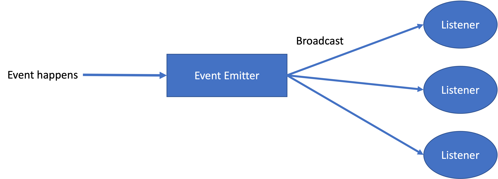

# Lab 8: Event-Driven Programming

In event-driven programming, code is executed upon activation of events such as user actions in a GUI program (e.g. key presses and mouse clicks). 



In a typical event-driven program, there exists an event emitter that manages the events. 
Users can register listeners in event emitter to handle every event emitted.
Each listener may define different logics to handle the event.
The event emitter is able to broadcast a certain event to a set of listeners. 

## Event

Java has a recommended implementation of event: `java.util.EventObject`
```java
public class EventObject implements java.io.Serializable {
    /**
     * The object on which the Event initially occurred.
     */
    protected transient Object source;

    /**
     * Constructs a prototypical Event.
     *
     * @param source the object on which the Event initially occurred
     * @throws IllegalArgumentException if source is null
     */
    public EventObject(Object source) {
        if (source == null)
            throw new IllegalArgumentException("null source");

        this.source = source;
    }

    /**
     * The object on which the Event initially occurred.
     *
     * @return the object on which the Event initially occurred
     */
    public Object getSource() {
        return source;
    }
}
```

Each event has a source, referring to the object where the event initially occurred. 

## Event Listener

To do this, we create a listener objected, which will be invoked when the event is triggered. 
There are three ways of defining an event listener:

### 1. Using a regular class
```java
class Listener implements EventListener {
  public void handle(Event e) {
      // handling the event
  }
}
```

### 2. Anonymous inner classes
```java
public class Application {
  public void start (eventEmitter EventEmitter) {
    eventEmitter.addListener(new EventListener() {
      public void handle(Event e) {
          // handling the event
      }
    });
  }
}
```

### 3. Lambda expressions
```java
public class  Application {
  public void start (eventEmitter EventEmitter) {
    eventEmitter.addListener( e -> {
        // handling the event
    });
  }
}
```

The third is preferred because it requires less typing and is easier to read.

## What you need to do

This lab defines an interface `TimeTicker`, which is an `EventEmitter`. 
`TimeTicker` has a `startTick()` method, which makes the ticker emit an event periodically with a time interval. 
The source of the event should be the `Date` object representing the time when the event occurs.
`TimeTicker` also provides `emitEvent()` method to allow manually emitting events. 
Your first task is to implement a `TimeTicker` class satisfying all its specifications as described by the Java doc.

Your second task is to write a class that uses the EventEmitter, i.e., `TimeTicker`. 
Class `EventSlicer` is designed to record the first n emitted events and return them in method `firstNEvents()`.
You also need to finish the implementation of `EventSlicer`.

Make sure you pass all the tests.

## Submission

Submit the project (as a `.zip`) on CASS. 

Deadline: 4 Nov. 2021, 23:55

